Commercial & Forecast Analytics

[🇧🇷 Português](#-visão-geral) | [🇺🇸 English](#-overview)

📐 Diagramas: [Arquitetura e Fluxos](docs/diagrams/ARCHITECTURE_QlikDashboard_V2.md)

---

## 🇧🇷 Visão Geral

**QlikDashboard** é uma plataforma web de analytics e suporte à decisão, inspirada no estilo do Qlik Sense, focada em **visualização de dados comerciais, financeiros e previsões inteligentes**.

> **Nota de Arquitetura (importante)**  
> Este repositório **não contém pipelines de Machine Learning**.  
> As previsões consumidas pelo dashboard são **geradas por pipelines externos**, mantidos em ambiente privado.  
> O foco deste projeto é **produto, arquitetura, governança, visualização e explainability**.

---

## 🇧🇷 Problema

Empresas com forte operação comercial e financeira enfrentam desafios como:

- Dados fragmentados entre vendas, orçamento, faturamento e caixa  
- Dificuldade em analisar desempenho no **Ano Francês (Set → Ago)**  
- Previsões pouco transparentes (“caixa‑preta”)  
- Falta de visão integrada entre **resultado realizado** e **cenários futuros**

---

## 🇧🇷 Solução

Uma aplicação web única que:

- Consolida dados comerciais e financeiros em tempo quase real  
- Apresenta previsões como **cenários comparáveis**, não como verdades absolutas  
- Explica **como** e **por que** uma previsão foi gerada  
- Mantém **separação clara** entre:
  - pipelines de ML
  - dados
  - camada de decisão (dashboard)

---

## 🇧🇷 Fluxo de Arquitetura (Resumo)

```mermaid
flowchart LR
  U[Usuários de Negócio] --> WEB[QlikDashboard<br/>Next.js + React]

  subgraph APP[Aplicação Web]
    UI[Dashboards & KPIs]
    API[API Routes<br/>Next.js]
  end

  WEB --> UI
  WEB --> API

  API --> DB[(PostgreSQL)]
  DB --> VIEWS[Views & Funções SQL]

  subgraph ML[Ambiente Externo de ML]
    PIPE[Pipelines de Previsão]
    JSON[Forecast Outputs]
  end

  PIPE --> JSON
  UI --> JSON
```

---

## 🇧🇷 Previsão Inteligente — Estado Atual

### Cenários de Previsão Disponíveis

- **Principal** — histórico + sazonalidade estatística  
- **Clima** — temperatura e precipitação (Open‑Meteo)  
- **Câmbio** — USD/BRL (Bacen / SGS)  
- **IPCA / SELIC** — indicadores macroeconômicos  

As previsões são **pré‑calculadas** e disponibilizadas como cenários independentes.

### Agregação de Cenários

- Agregação por **média simples**
- Objetivo: reduzir dependência de um único modelo
- Evolução prevista: pesos por desempenho histórico (sMAPE)

### KPIs (Ano Francês)

- Crescimento Projetado (AF)  
- Previsão do Semestre Atual (AF)  
- Previsão do Próximo Semestre (AF)  

---

## 🇧🇷 O que foi liderado neste projeto

- Arquitetura da aplicação e separação de responsabilidades  
- Governança de dados e previsões  
- Definição do modelo de explainability  
- Integração comercial, financeira e previsões  
- Entrega incremental (beta → validação → rollout)

---

## 🇧🇷 Status do Projeto

**Status:** Validação final / rollout controlado  
**Licença:** Proprietário – Todos os direitos reservados

---

## Módulo Financeiro (Visão Executiva)

O QlikDashboard inclui um módulo financeiro integrado, focado em visibilidade,
projeção e governança do caixa.

Funcionalidades principais:
- Contas a Receber e a Pagar (visão aberta, vencida, a vencer)
- KPIs financeiros: DSO, DPO, exposição e liquidez
- Fluxo de Caixa diário e projetado (curto, médio e longo prazo)
- Planejamento financeiro com investimentos e empréstimos
- Integração direta com views e funções SQL no PostgreSQL

O módulo foi desenhado para:
- Suportar decisões táticas (curto prazo)
- Apoiar planejamento financeiro e gestão de risco
- Garantir rastreabilidade e consistência dos números

---

## 🇺🇸 Overview

**QlikDashboard** is a web‑based analytics and decision‑support platform inspired by Qlik Sense, focused on **commercial, financial and intelligent forecasting dashboards**.

> **Architecture Note (important)**  
> This repository **does not include Machine Learning pipelines**.  
> Forecasts are **produced by external ML pipelines**, maintained in a private environment.  
> This project focuses on **product design, architecture, governance, visualization and explainability**.

---

## 🇺🇸 Problem

Companies with complex commercial and financial operations often face:

- Fragmented data across sales, budget, billing and cash flow  
- Difficulty analyzing performance using the **French Year (Sep → Aug)**  
- Black‑box forecasts with low trust  
- No integrated view between **actuals** and **future scenarios**

---

## 🇺🇸 Solution

A single web platform that:

- Consolidates commercial and financial data  
- Presents forecasts as **comparable scenarios**, not absolute truths  
- Clearly explains **how** and **why** forecasts are produced  
- Enforces a clean separation between:
  - ML pipelines
  - data sources
  - decision and visualization layer

---

## 🇺🇸 Architecture Flow (High Level)

---

## 🇺🇸 Intelligent Forecasting — Current State

### Available Forecast Scenarios

- **Core** — historical data + statistical seasonality  
- **Weather** — temperature and precipitation (Open‑Meteo)  
- **FX** — USD/BRL (Brazil Central Bank / SGS)  
- **Inflation & Interest** — IPCA / SELIC  

Forecasts are **pre‑computed** and exposed as independent scenarios.

### Scenario Aggregation

- Simple average aggregation
- Goal: reduce reliance on a single model
- Planned evolution: performance‑weighted aggregation (sMAPE)

### KPIs (French Year)

- Projected Growth (FY)  
- Current Semester Forecast (FY)  
- Next Semester Forecast (FY)  

---

## 🇺🇸 Leadership & Ownership

- Application architecture and system design  
- Data governance and forecast consumption model  
- Explainability strategy  
- Commercial and financial integration  
- End‑to‑end delivery (beta → validation → rollout)

---

## 🇺🇸 Project Status

**Status:** Final validation / controlled rollout  
**License:** Proprietary – All rights reserved

---

## Financial Module (Executive View)

QlikDashboard includes an integrated financial module focused on
cash visibility, projections, and financial governance.

Key capabilities:
- Accounts Receivable and Payable (open, overdue, upcoming)
- Financial KPIs: DSO, DPO, exposure, liquidity
- Daily and projected cash flow (short, mid, long term)
- Financial planning with investments and loans
- Direct integration with PostgreSQL views and functions

The module is designed to:
- Support short-term tactical decisions
- Enable financial planning and risk management
- Ensure data consistency and traceability
