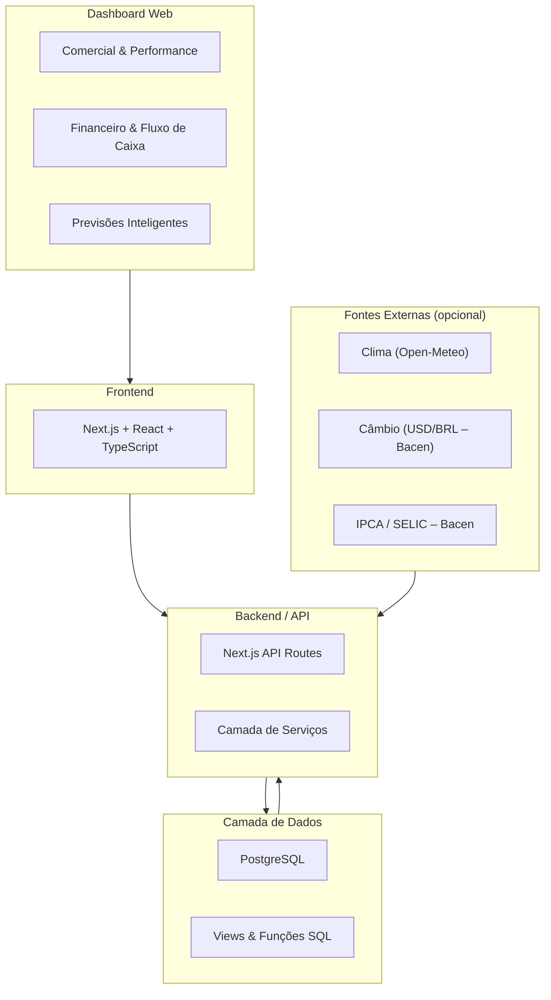

# QlikDashboard – Arquitetura v2 (Visão Pública)

## Visão Geral

Esta versão **v2** do diagrama explicita os **módulos funcionais principais**
do sistema, mantendo o mesmo desenho técnico da versão anterior,
apenas com melhor clareza de escopo e responsabilidades.

---

## Diagrama de Arquitetura (Mermaid)

---

## Componentes Representados

### Frontend
- Aplicação web em **Next.js**
- Camada única de UI consumindo APIs internas
- Separação lógica por domínio:
  - Comercial
  - Financeiro
  - Forecast

### Backend / API
- API Routes do Next.js
- Camada de serviços para:
  - Comercial (vendas, budget, performance)
  - Financeiro (CR/CP, fluxo, investimentos, empréstimos)
  - Forecast (consumo de previsões e agregações)

### Camada de Dados
- PostgreSQL como fonte única de verdade
- Uso intensivo de:
  - Views para consolidação
  - Funções SQL para projeções e cálculos financeiros

### Fontes Externas
- Variáveis macroeconômicas e climáticas
- Utilizadas **somente na geração de previsões**
- Pipelines de ML não fazem parte deste repositório público

---

## Observação Importante

Este diagrama representa **a arquitetura lógica e funcional** do sistema.
Detalhes de regras financeiras, fórmulas, modelos de ML e pipelines
são intencionalmente omitidos por se tratarem de conhecimento proprietário.

---

**Status:** arquitetura validada em produção  
**Uso:** documentação pública (LinkedIn / Portfólio)
